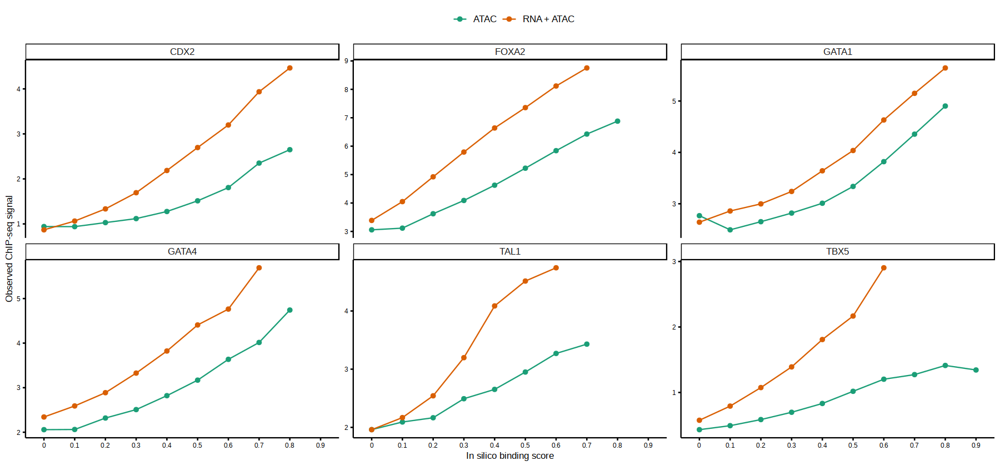

# in silico ChIP-seq
In silico ChIP-seq: leveraging multi-modal information to perform accurate prediction of transcription factor binding
sites.

## Introduction

The in silico ChIP-seq library is a computational approach to link TFs to cis-regulatory
elements in the form of ATAC peaks. Intuitively, we consider an ATAC peak i to be a putative
binding site for TF j if i contains the j motif and its chromatin accessibility correlates with the
RNA expression of j.

## Installation

devtools::install_github("Gavin-Lijy/in-silico-ChIP-seq")

## Example

```R
# Input:
# RNA SCE at choosen resolution
# ATAC SCE at choosen resolution
# Both need to contain lognormalised counts
# Both need to be matched & in the right order
```


```R
###################
## Load packages
###################
suppressPackageStartupMessages({
    library(scran)
    library(scater)
})
# source('utils.R')
```


```R
###################
## I/O
###################
io = list()
io$basedir = 'dir_of_yours'

## All celltype pseudobulk
io$RNA_sce = file.path(io$basedir, 'results/rna/pseudobulk/celltype/SingleCellExperiment_pseudobulk.rds')
io$ATAC_sce = file.path(io$basedir, 'results/atac/archR/pseudobulk/celltype/PeakMatrix/pseudobulk_PeakMatrix_summarized_experiment.rds')

io$motifmatcher <- file.path(io$basedir, "processed/atac/archR/Annotations/CISBP-Scores.rds")
io$motif2gene <- file.path(io$basedir, "processed/atac/archR/Annotations/CISBP_motif2gene.txt.gz")
io$background_peaks = file.path(io$basedir,"processed/atac/archR/Background-Peaks.rds")

```


```R
#######################
## Load RNA and ATAC 
#######################

# Load SingleCellExperiment
rna.sce <- readRDS(io$RNA_sce)

# Load ATAC SummarizedExperiment
atac.sce <- readRDS(io$ATAC_sce)

# Normalise ATAC data
assayNames(atac.sce) <- "counts"
assay(atac.sce,"logcounts") <- log(1e6*(sweep(assay(atac.sce),2,colSums(assay(atac.sce),na.rm=T),"/"))+1)

# Make sure that samples are consistent
samples <- intersect(colnames(rna.sce),colnames(atac.sce))
rna.sce <- rna.sce[,samples]
atac.sce <- atac.sce[,samples]

print(sprintf("Number of metacells: %s",length(samples)))
```

    [1] "Number of metacells: 37"


```R
# RNA dimreduction

decomp <- modelGeneVar(rna.sce)
decomp <- decomp[decomp$mean > 0.01,]
hvgs <- decomp[order(decomp$FDR),] %>% head(n=2000) %>% rownames

sce_filt <- rna.sce[hvgs,]
sce_filt <- runPCA(sce_filt, ncomponents = 20, ntop=2000)
```

    Warning message in (function (A, nv = 5, nu = nv, maxit = 1000, work = nv + 7, reorth = TRUE, :
    “You're computing too large a percentage of total singular values, use a standard svd instead.”


```R
sce_filt <- runUMAP(sce_filt, dimred="PCA", n_neighbors = 20, min_dist = 1.5)

umap.dt <- reducedDim(sce_filt,"UMAP") %>% as.data.table %>% 
  .[,cell:=colnames(sce_filt)] %>%
  setnames(c("UMAP1","UMAP2","cell"))
```


```R
options(repr.plot.width=5, repr.plot.height=4)
gene = 'Gata2'
ggplot(umap.dt, aes(UMAP1, UMAP2, col=as.vector(assay(rna.sce[gene,], 'logcounts')))) + 
    geom_point() +
    viridis::scale_color_viridis(begin=1, end=0, name=gene) + 
    ggtitle(paste0(gene, ' - Expression')) + 
    theme_void()
```


​    

​    


```R
head(colData(rna.sce))
```


    DataFrame with 6 rows and 0 columns


```R
gene1 = 'Eomes'
gene2 = 'Gata2'
options(repr.plot.width=5, repr.plot.height=5)
ggplot(data.table(dummy = rep('a', length(colnames(rna.sce)))), aes(as.vector(logcounts(rna.sce[gene1,])), as.vector(logcounts(rna.sce[gene2,])))) + 
                    geom_point() + 
                    theme_bw()
```


​    

​    


```R
#######################
## Load Motifs if wanted
#######################
motifmatcher.se <- readRDS(io$motifmatcher)

# Subset peaks
stopifnot(sort(rownames(motifmatcher.se))==sort(rownames(atac.sce)))
motifmatcher.se <- motifmatcher.se[rownames(atac.sce),]

motif2gene.dt <- fread(io$motif2gene)
```


```R
motifmatcher.se
```


    class: RangedSummarizedExperiment 
    dim: 192251 871 
    metadata(0):
    assays(3): motifScores motifMatches motifCounts
    rownames(192251): chr1:3035602-3036202 chr1:3062653-3063253 ...
      chrX:169925487-169926087 chrX:169937064-169937664
    rowData names(13): score replicateScoreQuantile ... idx N
    colnames(871): TFAP2B_1 TFAP2D_2 ... TBX22_870 TBXT
    colData names(1): name


```R
###################
## Correlate TF-expr & Region-accessibility
###################  
a = Sys.time()
tf2peak_cor.se = cor_TF_acc(rna.sce, 
                          atac.sce, 
                          TFs_filt = NULL,  # c('SOX17', 'MYBL1') -> test runs
                          motifmatcher.se = motifmatcher.se, 
                          motif2gene.dt = motif2gene.dt,
                          correlation_method = "pearson", 
                          remove_motifs = c("T_789"))
b = Sys.time()
b-a
```

    [1] "Removing 0 TFs that have duplicated gene-motif pairs:\n"


    Correlate TF-expr & Region-accessibility for 738 TFs


    Time difference of 49.80964 secs


```R
gata1 = assay(tf2peak_cor.se[, 'GATA1'], 'cor')
```


```R
as.data.table(as.matrix(gata1), keep.rownames=T) %>% .[order(GATA1)] %>% head()
```


<table class="dataframe">
<caption>A data.table: 6 × 2</caption>
<thead>
	<tr><th scope=col>rn</th><th scope=col>GATA1</th></tr>
	<tr><th scope=col>&lt;chr&gt;</th><th scope=col>&lt;dbl&gt;</th></tr>
</thead>
<tbody>
	<tr><td>chr2:30758339-30758939   </td><td>-0.864</td></tr>
	<tr><td>chr9:48898438-48899038   </td><td>-0.837</td></tr>
	<tr><td>chr15:101970432-101971032</td><td>-0.828</td></tr>
	<tr><td>chr11:99574015-99574615  </td><td>-0.814</td></tr>
	<tr><td>chr2:80448187-80448787   </td><td>-0.812</td></tr>
	<tr><td>chr5:114467253-114467853 </td><td>-0.807</td></tr>
</tbody>
</table>


```R
gene = 'Gata1'
peak = 'chr3:121539657-121540257'
options(repr.plot.width=5, repr.plot.height=5)
ggplot(data.table(dummy = rep('a', length(colnames(rna.sce)))), aes(as.vector(logcounts(rna.sce[gene,])), as.vector(assay(atac.sce[peak,], 'logcounts')))) + 
                    geom_point() + 
                    theme_bw()
```


​    

​    


```R
summary(duplicated(colnames(tf2peak_cor.se)))
```


       Mode   FALSE 
    logical     738 


```R
######################################
## Create virtual chip-seq library 
######################################
a = Sys.time()
motifmatcher_chip = silico_chip(atac.sce = atac.sce, 
                           tf2peak_cor.se = tf2peak_cor.se,
                           motifmatcher.se = motifmatcher.se,
                           motif2gene.dt = motif2gene.dt, 
                           min_number_peaks = 50,
                           TFs_filt = NULL, 
                           remove_motifs = c("T_789"),
                           cores = detectCores())

motifmatcher_chip.se = motifmatcher_chip$motifmatcher_chip.se
virtual_chip.dt = motifmatcher_chip$virtual_chip.dt
b = Sys.time()
b-a
```

    [1] "Number of peaks: 192251"
    [1] "Predicting TF binding sites..."
    [1] "Number of TFs: 738"
    [1] "Updating motifmatchr results using the virtual ChIP-seq library..."


    Time difference of 35.73179 secs


```R
virtual_chip.dt = motifmatcher_chip$virtual_chip.dt

```


```R
head(virtual_chip.dt)
```


<table class="dataframe">
<caption>A data.table: 6 × 6</caption>
<thead>
	<tr><th scope=col>peak</th><th scope=col>score</th><th scope=col>correlation_score</th><th scope=col>max_accessibility_score</th><th scope=col>motif_score</th><th scope=col>tf</th></tr>
	<tr><th scope=col>&lt;fct&gt;</th><th scope=col>&lt;dbl&gt;</th><th scope=col>&lt;dbl&gt;</th><th scope=col>&lt;dbl&gt;</th><th scope=col>&lt;dbl&gt;</th><th scope=col>&lt;chr&gt;</th></tr>
</thead>
<tbody>
	<tr><td>chr2:153425804-153426404</td><td>0.61</td><td>0.81</td><td>3.75</td><td>0.89</td><td>TFAP2B</td></tr>
	<tr><td>chr15:98033194-98033794 </td><td>0.54</td><td>0.76</td><td>3.42</td><td>0.93</td><td>TFAP2B</td></tr>
	<tr><td>chr7:98404013-98404613  </td><td>0.53</td><td>0.76</td><td>3.62</td><td>0.87</td><td>TFAP2B</td></tr>
	<tr><td>chr9:67320850-67321450  </td><td>0.53</td><td>0.84</td><td>3.19</td><td>0.91</td><td>TFAP2B</td></tr>
	<tr><td>chr18:65530295-65530895 </td><td>0.51</td><td>0.74</td><td>3.49</td><td>0.89</td><td>TFAP2B</td></tr>
	<tr><td>chr7:93037659-93038259  </td><td>0.51</td><td>0.79</td><td>3.36</td><td>0.89</td><td>TFAP2B</td></tr>
</tbody>
</table>


```R
head(to.plot)
```


<table class="dataframe">
<caption>A data.table: 6 × 6</caption>
<thead>
	<tr><th scope=col>idx</th><th scope=col>value</th><th scope=col>score</th><th scope=col>motif_score</th><th scope=col>max_accessibility_score</th><th scope=col>chip_anno</th></tr>
	<tr><th scope=col>&lt;chr&gt;</th><th scope=col>&lt;dbl&gt;</th><th scope=col>&lt;dbl&gt;</th><th scope=col>&lt;dbl&gt;</th><th scope=col>&lt;dbl&gt;</th><th scope=col>&lt;fct&gt;</th></tr>
</thead>
<tbody>
	<tr><td>chr10:100023695-100024295</td><td>143.01099</td><td> 0.30</td><td>0.95</td><td>2.57</td><td>CDX2</td></tr>
	<tr><td>chr10:100034910-100035510</td><td>  1.72115</td><td> 0.02</td><td>0.88</td><td>2.06</td><td>CDX2</td></tr>
	<tr><td>chr10:100042137-100042737</td><td>  1.46037</td><td> 0.01</td><td>1.00</td><td>2.25</td><td>CDX2</td></tr>
	<tr><td>chr10:100065912-100066512</td><td> 37.29132</td><td> 0.31</td><td>1.00</td><td>2.98</td><td>CDX2</td></tr>
	<tr><td>chr10:10038933-10039533  </td><td>  2.45133</td><td>-0.03</td><td>0.89</td><td>2.23</td><td>CDX2</td></tr>
	<tr><td>chr10:10051908-10052508  </td><td>  1.14744</td><td>-0.02</td><td>0.91</td><td>1.66</td><td>CDX2</td></tr>
</tbody>
</table>


```R
######################################
## silico_chipseq_validation
######################################
library(GenomicRanges)
library(rtracklayer)

io$chip_dir.prefix <- "/rds/project/rds-SDzz0CATGms/users/bt392/atlasses/gastrulation_multiome/results/revisions/chip_files"
io$chip.files <- c(
  "CDX2" = file.path(io$chip_dir.prefix, "GSM2253707_Cdx2_wtEpiSCs_24h_rep1_mm10.bw"),
  "TAL1" = file.path(io$chip_dir.prefix, "GSM1692858_HP_Tal1.bw"),
  "GATA1" = file.path(io$chip_dir.prefix, "GSM1692851_HP_Gata1.bw"),
  "FOXA2" = file.path(io$chip_dir.prefix, "Foxa2.d5FS.bw"),
  "GATA4" = file.path(io$chip_dir.prefix, "GSM3223330_Gata4.d5FS.r1_m1.ucsc.bigWig"),
  "TBX5" = file.path(io$chip_dir.prefix, "Tbx5_WT_CP.bw")
)
peak_metadata.gr = makeGRangesFromDataFrame(rowData(atac.sce))
stopifnot(file.exists(io$chip.files))
TFs <- names(io$chip.files)

## calculate background ChIP signal 
chip_background.dt <- mclapply(TFs, function(i) {
  data.table(
    chip_anno = i,
    median = median(import.bw(BigWigFile(io$chip.files[[i]]))$score)
  )
}, mc.cores=10) %>% rbindlist

## calculate signal 
peak_metadata_ucsc.gr <- peak_metadata.gr; seqlevelsStyle(peak_metadata_ucsc.gr) <- 'UCSC'
peak_metadata_ncbi.gr <- peak_metadata.gr; seqlevelsStyle(peak_metadata_ncbi.gr) <- 'NCBI'
tf2seqstyle <- rep("UCSC",length(TFs)); names(tf2seqstyle) <- TFs
tf2seqstyle["TBX5"] <- "NCBI"

to.plot <- mclapply(TFs, function(i){
  # Load virtual ChIP-seq library
    virtual_chip_tmp = copy(virtual_chip.dt)[tf==i] %>% 
        setnames('peak', 'idx') %>% 
        .[,idx:=str_replace(idx,":","-")] %>%
        .[,chr:=strsplit(idx,"-") %>% map_chr(1)] %>%
        .[,start:=as.integer(strsplit(idx,"-") %>% map_chr(2))] %>%
        .[,end:=as.integer(strsplit(idx,"-") %>% map_chr(3))] %>%
        .[,idx:=str_replace(idx,"-",":")] %>% 
        setkey(chr,start,end)

    # Load ground truth ChIP-seq data
    if (tf2seqstyle[[i]]=="UCSC") {
        tmp <- peak_metadata_ucsc.gr
    } else if (tf2seqstyle[[i]]=="NCBI") {
        tmp <- peak_metadata_ncbi.gr
    }

    chip.dt <- import.bw(BigWigFile(io$chip.files[[i]]), selection = tmp) %>% as.data.table %>%
        .[,c(1,2,3,6)] %>% setnames(c("chr", "start", "end","value")) %>%
        .[,chr:=as.character(chr)] %>%
        .[,chr:=ifelse(grepl("chr",chr),chr,paste0("chr",chr))] %>%
      setkey(chr,start,end)

      # overlap ATAC peaks with ChIP-seq signal and quantify ChIP signal
    to.plot =  virtual_chip_tmp[,c("idx","chr","start","end")] %>%
        foverlaps(chip.dt, nomatch=0) %>% 
        .[,.(value=sum(value)), b=c("idx")] %>%
        merge(virtual_chip_tmp[,c("idx","score","motif_score", "max_accessibility_score")]) %>%
        .[,chip_anno:=as.factor(i)] %>%
        return
  
}, mc.cores=10) %>% rbindlist

seq.ranges <- seq(0,1,by=0.10); names(seq.ranges) <- as.character(1:length(seq.ranges))

foo <- to.plot %>%
  .[score>=0] %>% 
  merge(chip_background.dt,by="chip_anno") %>%
  .[,log_value:=log(value+1)] %>%
  .[,c("chip_anno","idx","log_value","motif_score","score", "max_accessibility_score")] %>%
  setnames("score","score_rna_atac")

to.plot.compare_models <- foo %>%
  # Model 1: DNA
  # .[,score_dna:=minmax.normalisation(motif_score), by="chip_anno"] %>% 
  # Model 2: DNA + ATAC
  .[,score_dna_atac:=minmax.normalisation(max_accessibility_score * motif_score), by="chip_anno"] %>% .[,score_dna_atac:=score_dna_atac+0.001] %>%
  # Model 3: DNA + ATAC + RNA
  .[,score_rna_atac:=minmax.normalisation(score_rna_atac), by="chip_anno"] %>% .[,score_rna_atac:=score_rna_atac+0.001] %>%
  # Discretise values
  # .[,score_dna_group:=cut(abs(score_dna), breaks=seq.ranges)] %>% .[,score_dna_group:=seq.ranges[as.numeric(score_dna_group)]] %>%
  .[,score_dna_atac_group:=cut(abs(score_dna_atac), breaks=seq.ranges)] %>% .[,score_dna_atac_group:=seq.ranges[as.numeric(score_dna_atac_group)]] %>%
  .[,score_rna_atac_group:=cut(abs(score_rna_atac), breaks=seq.ranges)] %>% .[,score_rna_atac_group:=seq.ranges[as.numeric(score_rna_atac_group)]] %>%
  # Prepare for plotting
  melt(id.vars=c("chip_anno","idx","log_value"), measure.vars=c("score_dna_atac_group","score_rna_atac_group"), variable.name="model", value.name="predicted_value") %>%
  .[,N:=.N,by=c("model","chip_anno","predicted_value")] %>%
  .[,.(mean=mean(log_value,na.rm=T), sd=sd(log_value,na.rm=T), N=.N), by=c("model","chip_anno","predicted_value")] %>%
  # Filter settings with a small number of observations
  .[!is.na(mean) & N>=25]
```


```R
options(repr.plot.width=15, repr.plot.height=7)
ggline(to.plot.compare_models, x="predicted_value", y="mean", color="model", plot_type="b") +
  facet_wrap(~chip_anno, scales="free_y") +
  # geom_errorbar(aes(ymin=log_value-sd, ymax=log_value-sd), width=.2,) +
  scale_color_brewer(palette="Dark2", labels = c("ATAC", "RNA + ATAC")) +
  # scale_color_discrete(labels = c("DNA", "DNA + ATAC", "DNA + ATAC + RNA")) +
  labs(y="Observed ChIP-seq signal", x="In silico binding score") +
  theme(
    strip.background = element_rect(colour="black", fill=NA),
    axis.text = element_text(size=rel(0.55)),
    axis.title = element_text(size=rel(0.8)),
    legend.title = element_blank(),
    # legend.position = c(.26,.87)
    # legend.position = c(.06,.94)
    legend.position = "top"
  )
```


​    

​    


```R

```


```R

```


```R
######################################
## ChromVAR - ChIP-seq
######################################
a = Sys.time()
# load background peak set
bgdPeaks.se <- readRDS(io$background_peaks)

chromvar_deviations.se = chromVAR_chip(atac.sce = atac.sce, 
                                                   motifmatcher_chip.se = motifmatcher_chip.se,
                                                   assay = 'VirtualChipScores',
                                                   background = bgdPeaks.se,
                                                   genome = NULL, # Only needed if background = NULL
                                                   positive_only = TRUE, 
                                                   min_chip_score = 0.15,
                                                   min_number_peaks = 50,
                                                   TFs_filt = NULL,
                                                   test = FALSE,
                                                   method = 'ArchR', # Option 'ArchR' or 'ChromVAR'
                                                   cores = detectCores())
b = Sys.time()
b-a
```

    [1] "Number of matches before filtering negative TF binding values: 18945532"
    [1] "Number of matches after filtering negative TF binding values: 10714289"
    [1] "Number of matches before filtering based on minimum ChIP-seq score: 10714289"
    [1] "Number of matches after filtering based on minimum ChIP-seq score: 1409335"
    9 TFs removed because they don't have enough binding sites: E2F3 HOXC12 PAX1 POU1F1 SIM2 TBX1 TBX18 TBX22 TOPORS 
    Running ChromVAR-ChIP-seq (ArchR implementation) 


    as(<lgCMatrix>, "dgCMatrix") is deprecated since Matrix 1.5-0; do as(., "dMatrix") instead


    Time difference of 4.106623 mins


```R
chromvar_deviations_original.se = chromVAR_chip(atac.sce = atac.sce, 
                                                   motifmatcher_chip.se = motifmatcher_chip.se,
                                                   assay = 'motifScores',
                                                   background = bgdPeaks.se,
                                                   genome = NULL, # Only needed if background = NULL
                                                   positive_only = FALSE, 
                                                   min_chip_score = 0,
                                                   min_number_peaks = 50,
                                                   TFs_filt = NULL,
                                                   test = FALSE,
                                                   method = 'ArchR', # Option 'ArchR' or 'ChromVAR'
                                                   cores = detectCores())
```

    [1] "Number of matches before filtering based on minimum ChIP-seq score: 18945532"
    [1] "Number of matches after filtering based on minimum ChIP-seq score: 18945532"
    Running ChromVAR-ChIP-seq (ArchR implementation) 


```R
TF = 'GATA1'

p1 = ggplot(umap.dt, aes(UMAP1, UMAP2, col=as.vector(assay(rna.sce, 'logcounts')[str_to_title(TF),]))) + 
    geom_point() +
    viridis::scale_color_viridis(begin=1, end=0, name=TF) + 
    ggtitle(paste0(TF, ' - Expression')) + 
    theme_void()

p2 = ggplot(umap.dt, aes(UMAP1, UMAP2, col=as.vector(assay(chromvar_deviations.se, 'z')[TF,]))) + 
    geom_point() +
    scale_color_gradient2(low='blue', mid='lightyellow', high='red', name=TF) + 
    ggtitle('ChromVAR-ChIP-seq') + 
    theme_void()

p3 = ggplot(umap.dt, aes(UMAP1, UMAP2, col=as.vector(assay(chromvar_deviations_original.se, 'z')[TF,]))) + 
    geom_point() +
    scale_color_gradient2(low='blue', mid='lightyellow', high='red', name=TF) + 
    ggtitle('ChromVAR-original') + 
    theme_void()
options(repr.plot.width=15, repr.plot.height=4)
ggarrange(p1, p2, p3, nrow = 1)
```


​    

​    


```R
TF_correlations = mclapply(unique(rownames(chromvar_deviations.se)), function(x){
      corr_man/img/output <- psych::corr.test(
        x = as.vector(assay(chromvar_deviations.se[x,], 'z')), 
        y = as.vector(assay(rna.sce[str_to_title(x),], 'logcounts')), 
        ci = FALSE,
        method = 'pearson'
      )
    
    tmp = data.table(tf = x,
                     cor = round(corr_man/img/output$r,3),
                     pval = round(corr_man/img/output$p,10))
    return(tmp)
}, mc.cores = detectCores()) %>% rbindlist() %>%
    .[order(-cor)] %>%
    .[,rank:=.I]
```


```R
options(repr.plot.width=7, repr.plot.height=4)
ggplot(TF_correlations, aes(rank, cor)) + 
    geom_point(col='gray80') +
    ggrepel::geom_text_repel(data = head(TF_correlations, 10), aes(label=tf)) + 
    ggtitle('TF-ChromVAR correlations') + 
    ylab('Correlation score') + 
    theme_bw()
```

    Warning message:
    “ggrepel: 7 unlabeled data points (too many overlaps). Consider increasing max.overlaps”


    


```R
######################################
## link TF2genes virtual chip
######################################
# peak2gene (also possible to find them in the function, need to supply gene metadata with gene locations(e.g. from biomaRt))
peak2gene <- file.path(io$basedir,"results/atac/archR/peak_calling/peaks2genes/peaks2genes_all.txt.gz") 

## Load peak2gene linkages using only genomic distance
peak2gene.dt <- fread(peak2gene)
head(peak2gene.dt)
summary(peak2gene.dt$dist)

a = Sys.time()
TF2Gene_links = TF2Gene(rna.sce = rna.sce, 
                   motifmatcher_chip.se = motifmatcher_chip.se,
                   peak2gene.dt = peak2gene.dt,
                   min_chip_score = 0.15,
                   distance = 1.5e5, # Can not be higher than the max distance in peak2gene.dt, unless recalculated from gene metadata file
                   cores = detectCores())
b = Sys.time()
b-a
head(TF2Gene_links)
```


<table class="dataframe">
<caption>A data.table: 6 × 11</caption>
<thead>
	<tr><th scope=col>chr</th><th scope=col>gene</th><th scope=col>ens_id</th><th scope=col>strand</th><th scope=col>gene.start</th><th scope=col>gene.end</th><th scope=col>peak.start</th><th scope=col>peak.end</th><th scope=col>peak</th><th scope=col>peak.mean</th><th scope=col>dist</th></tr>
	<tr><th scope=col>&lt;chr&gt;</th><th scope=col>&lt;chr&gt;</th><th scope=col>&lt;chr&gt;</th><th scope=col>&lt;chr&gt;</th><th scope=col>&lt;int&gt;</th><th scope=col>&lt;int&gt;</th><th scope=col>&lt;int&gt;</th><th scope=col>&lt;int&gt;</th><th scope=col>&lt;chr&gt;</th><th scope=col>&lt;int&gt;</th><th scope=col>&lt;dbl&gt;</th></tr>
</thead>
<tbody>
	<tr><td>1</td><td>4933401J01Rik</td><td>ENSMUSG00000102693</td><td>+</td><td>3073253</td><td>3074322</td><td>3035602</td><td>3036202</td><td>chr1:3035602-3036202</td><td>3035902</td><td>37351</td></tr>
	<tr><td>1</td><td>Gm26206      </td><td>ENSMUSG00000064842</td><td>+</td><td>3102016</td><td>3102125</td><td>3035602</td><td>3036202</td><td>chr1:3035602-3036202</td><td>3035902</td><td>66114</td></tr>
	<tr><td>1</td><td>4933401J01Rik</td><td>ENSMUSG00000102693</td><td>+</td><td>3073253</td><td>3074322</td><td>3062653</td><td>3063253</td><td>chr1:3062653-3063253</td><td>3062953</td><td>10300</td></tr>
	<tr><td>1</td><td>Gm26206      </td><td>ENSMUSG00000064842</td><td>+</td><td>3102016</td><td>3102125</td><td>3062653</td><td>3063253</td><td>chr1:3062653-3063253</td><td>3062953</td><td>39063</td></tr>
	<tr><td>1</td><td>4933401J01Rik</td><td>ENSMUSG00000102693</td><td>+</td><td>3073253</td><td>3074322</td><td>3072313</td><td>3072913</td><td>chr1:3072313-3072913</td><td>3072613</td><td>  640</td></tr>
	<tr><td>1</td><td>Gm26206      </td><td>ENSMUSG00000064842</td><td>+</td><td>3102016</td><td>3102125</td><td>3072313</td><td>3072913</td><td>chr1:3072313-3072913</td><td>3072613</td><td>29403</td></tr>
</tbody>
</table>


       Min. 1st Qu.  Median    Mean 3rd Qu.    Max.    NA's 
          0   14209   42567   43702   71333  100300    5259 


    Number of TFs: 254 
    Number of genes: 12913 


    Time difference of 1.789929 mins


<table class="dataframe">
<caption>A data.table: 6 × 4</caption>
<thead>
	<tr><th scope=col>tf</th><th scope=col>gene</th><th scope=col>beta</th><th scope=col>pvalue</th></tr>
	<tr><th scope=col>&lt;chr&gt;</th><th scope=col>&lt;chr&gt;</th><th scope=col>&lt;dbl&gt;</th><th scope=col>&lt;chr&gt;</th></tr>
</thead>
<tbody>
	<tr><td>AR    </td><td>Mdm1</td><td>0.091</td><td>0.133</td></tr>
	<tr><td>ARNT2 </td><td>Mdm1</td><td>0.095</td><td>0.102</td></tr>
	<tr><td>BACH2 </td><td>Mdm1</td><td>0.027</td><td>0.714</td></tr>
	<tr><td>BCL11A</td><td>Mdm1</td><td>0.017</td><td>0.684</td></tr>
	<tr><td>BCL11B</td><td>Mdm1</td><td>0.069</td><td>0.156</td></tr>
	<tr><td>CDX1  </td><td>Mdm1</td><td>0.073</td><td>0.229</td></tr>
</tbody>
</table>


```R
# Inspect silico ChIP-scores & TF-gene beta values
options(repr.plot.width=20, repr.plot.height=3)
chip_scores = as.vector(assay(motifmatcher_chip.se, 'VirtualChipScores'))
chip_scores = chip_scores[abs(chip_scores)>0.01]
p1 = gghistogram(chip_scores[abs(chip_scores)<quantile(abs(chip_scores), 0.99)], bins=100) + ggtitle('in silico ChIP-scores')
p2 = gghistogram(TF2Gene_links$beta[abs(TF2Gene_links$beta)>0.05 & abs(TF2Gene_links$beta)<quantile(abs(TF2Gene_links$beta), 0.99)], bins=100) + ggtitle('TF-gene beta values')
ggarrange(p1, p2)
```

    Warning message in .sparse2v(x):
    “sparse->dense coercion: allocating vector of size 1.0 GiB”


    


```R
suppressMessages(library(GGally))
suppressMessages(library(igraph))
#suppressMessages(library(network))
#suppressMessages(library(sna))
suppressMessages(library(ggraph))
suppressMessages(library(igraph))
suppressMessages(library(tibble))
suppressMessages(library(tidygraph))
```


```R
#################
## Build GRN
#################
max_distance = 1.5e5
min_chip_score = 0.15
min_beta = 0.1
min_pvalue = 0.1
min_TF_expr = 5 # Min logcounts
TF_filter = NULL #c('GATA1', 'TAL1', 'HOXB8', 'LYL1')#c('HOXB8')
TF_TF_only = TRUE
motifmatcher_chip.se = motifmatcher_chip.se
assay = 'VirtualChipScores'
rna.sce = rna.sce
min_targets = 3
cores = detectCores()
```


```R

```


```R
tf2gene_chip.dt <- mclapply(colnames(assay(motifmatcher_chip.se, assay)), function(i){
        virtual_chip.mtx = assay(motifmatcher_chip.se, assay)
        # Select target peaks (note that we only take positive correlations into account)
        target_peaks_i <- names(which(virtual_chip.mtx[,i]>=min_chip_score))
        if (length(target_peaks_i)>=1) {
            tmp <- data.table(
              tf = i,
              peak = target_peaks_i,
              chip_score = virtual_chip.mtx[target_peaks_i,i]
            ) %>% merge(peak2gene.dt[peak %in% target_peaks_i,c("peak","gene","dist")], by="peak")
            return(tmp)
            }
        }, mc.cores=cores) %>% rbindlist %>%
        .[,gene:=toupper(gene)] %>%
        .[chip_score >= min_chip_score & dist <= max_distance]

options(repr.plot.width=6, repr.plot.height=3)
max_expr = data.table(tf = unique(tf2gene_chip.dt$tf),
                      max_expr = rowMaxs(logcounts(rna.sce[str_to_title(unique(tf2gene_chip.dt$tf)),])))

gghistogram(max_expr$max_expr) + ggtitle('Max expression of TFs')
TF_keep = max_expr[max_expr>=min_TF_expr, toupper(tf)]

GRN_coef.dt <- TF2Gene_links %>% 
  .[pvalue<min_pvalue & abs(beta)>=min_beta] %>%
  .[,gene:=toupper(gene)] %>%
  .[tf %in% TF_keep]
if(!is.null(TF_filter)){
    GRN_coef.dt = GRN_coef.dt[tf %in% TF_filter]
}
if(TF_TF_only){
    GRN_coef.dt = GRN_coef.dt[gene %in% tf]
}

GRN.dt = merge(GRN_coef.dt, tf2gene_chip.dt, by=c('tf', 'gene')) %>% 
    .[,c('tf', 'peak', 'gene', 'dist', 'chip_score', 'beta', 'pvalue')] %>% 
    unique(by=c('tf', 'gene')) %>%
    .[,c('tf', 'gene', 'beta')] %>% 
    .[,N := .N, by='tf'] %>%
    .[N >= min_targets] 

if(TF_TF_only){
    GRN.dt = GRN.dt[gene %in% tf]
}
```

    Warning message:
    “Using `bins = 30` by default. Pick better value with the argument `bins`.”


    


```R
# Create node and edge data.frames
TFs <- unique(c(GRN.dt$tf,GRN.dt$gene))
node_list.dt <- data.table(node_id=1:length(TFs), node_name=TFs)
edge_list.dt <- GRN.dt[,c("tf","gene","beta")] %>% setnames(c("from","to","weight")) %>% .[!from==to]

# Create igraph object
igraph.net <- graph_from_data_frame(d = edge_list.dt)

# Create tbl_graph object for ggraph
igraph.tbl <- as_tbl_graph(igraph.net) %>%
  activate(nodes) %>%
  mutate(tf=names(V(igraph.net))) %>%
  mutate(degree=igraph::degree(igraph.net)) %>%
  mutate(eigen_centrality=eigen_centrality(igraph.net)$vector) %>%
  activate(edges) %>%
  mutate(sign=ifelse(E(igraph.net)$weight>0,"Positive","Negative")) %>%
  mutate(weight=abs(weight))
```

    Warning message in eigen_centrality(igraph.net):
    “At core/centrality/centrality_other.c:184 : Negative weight in graph. The largest eigenvalue will be selected, but it may not be the largest in magnitude.”


```R
igraph.tbl
```


    # A tbl_graph: 225 nodes and 8318 edges
    #
    # A directed simple graph with 1 component
    #
    # Edge Data: 8,318 × 4 (active)
       from    to weight sign    
      <int> <int>  <dbl> <chr>   
    1     1     6  0.366 Positive
    2     1    27  0.557 Positive
    3     1    60  0.45  Positive
    4     1    72  0.326 Positive
    5     1    73  0.363 Positive
    6     1    92  0.261 Positive
    # … with 8,312 more rows
    #
    # Node Data: 225 × 4
      name   tf     degree eigen_centrality
      <chr>  <chr>   <dbl>            <dbl>
    1 ALX1   ALX1       28            0.187
    2 AR     AR         27            0.141
    3 ARID5B ARID5B     83            0.389
    # … with 222 more rows


```R

```


```R
options(repr.plot.width=20, repr.plot.height=15)

ggraph(igraph.tbl, 'kk') +
  geom_edge_link(aes(edge_colour = sign, alpha=weight), edge_width=0.15, arrow=arrow(length=unit(1.5,'mm')), end_cap=circle(4,'mm')) +
  scale_edge_colour_manual(values=c("Positive"="darkgreen", "Negative"="darkred")) +
  geom_node_point(size=9, alpha=0.75, col='lightblue') +
  geom_node_text(aes(label = name)) +
  theme_graph()
```

    Warning message:
    “Using the `size` aesthetic in this geom was deprecated in ggplot2 3.4.0.
    ℹ Please use `linewidth` in the `default_aes` field and elsewhere instead.”


    


# ChromVAR on single-cell data


```R
# io$ATAC_sce = file.path(io$outdir,sprintf("PeakMatrix_summarized_experiment_metacells.rds"))
# io$RNA_sce = file.path(io$outdir,"SingleCellExperiment_metacells.rds")
```


```R
io$RNA_sce = file.path(io$basedir,"data/processed/rna/SingleCellExperiment.rds")
io$ATAC_sce = file.path(io$basedir,"data/processed/atac/archR/Matrices/PeakMatrix_summarized_experiment.rds")
```


```R
#######################
## Load RNA and ATAC 
#######################

# Load SingleCellExperiment
rna.sce <- readRDS(io$RNA_sce)

# Load ATAC SummarizedExperiment
atac.sce <- readRDS(io$ATAC_sce)

# Make sure that samples are consistent
samples <- intersect(colnames(rna.sce),colnames(atac.sce))
rna.sce <- rna.sce[,samples]
atac.sce <- atac.sce[,samples]

print(sprintf("Number of metacells: %s",length(samples)))
# Normalise ATAC data
assayNames(atac.sce) <- "counts"
assay(atac.sce, 'logcounts') = assay(atac.sce, 'counts') # Try with TF-IDF normalisation
#assay(atac.sce,"logcounts") <- log(1e6*(sweep(assay(atac.sce),2,colSums(assay(atac.sce),na.rm=T),"/"))+1) # not possible for single-cell data due to massive file size
```

    [1] "Number of metacells: 61886"


```R
rna.sce
atac.sce
```


    class: SingleCellExperiment 
    dim: 32285 61886 
    metadata(0):
    assays(1): counts
    rownames(32285): Xkr4 Gm1992 ... AC234645.1 AC149090.1
    rowData names(0):
    colnames(61886): E7.5_rep1#AAACAGCCAAACCCTA-1
      E7.5_rep1#AAACAGCCATCCTGAA-1 ... E8.5_CRISPR_T_WT#TTTGTTGGTGGCTTCC-1
      E8.5_CRISPR_T_WT#TTTGTTGGTTGGCCGA-1
    colData names(10): barcode sample ... pass_rnaQC sizeFactor
    reducedDimNames(0):
    mainExpName: RNA
    altExpNames(0):


    class: RangedSummarizedExperiment 
    dim: 192251 61886 
    metadata(0):
    assays(2): counts logcounts
    rownames(192251): chr1:3035602-3036202 chr1:3062653-3063253 ...
      chrX:169925487-169926087 chrX:169937064-169937664
    rowData names(1): idx
    colnames(61886): E7.5_rep1#AAACAGCCAAACCCTA-1
      E7.5_rep1#AAACAGCCATCCTGAA-1 ... E8.5_CRISPR_T_WT#TTTGTTGGTGGCTTCC-1
      E8.5_CRISPR_T_WT#TTTGTTGGTTGGCCGA-1
    colData names(35): BlacklistRatio nDiFrags ... ReadsInPeaks FRIP


```R
rna.sce = logNormCounts(rna.sce)
```


```R
# RNA dimreduction

decomp <- modelGeneVar(rna.sce)
decomp <- decomp[decomp$mean > 0.01,]
hvgs <- decomp[order(decomp$FDR),] %>% head(n=2500) %>% rownames

sce_filt <- rna.sce[hvgs,]
sce_filt <- runPCA(sce_filt, ncomponents = 35, ntop=2500)
```


```R
sce_filt <- runUMAP(sce_filt, dimred="PCA", n_neighbors = 20, min_dist = 1.5)

umap.dt <- reducedDim(sce_filt,"UMAP") %>% as.data.table %>% 
  .[,cell:=colnames(sce_filt)] %>%
  setnames(c("UMAP1","UMAP2","cell"))
```


```R
options(repr.plot.width=5, repr.plot.height=4)
gene = 'Gata2'
ggplot(umap.dt, aes(UMAP1, UMAP2, col=as.vector(assay(rna.sce[gene,], 'logcounts')))) + 
    geom_point() +
    viridis::scale_color_viridis(begin=1, end=0, name=gene) + 
    ggtitle(paste0(gene, ' - Expression')) + 
    theme_void()
```


​    

​    


```R
atac.sce
```


    class: RangedSummarizedExperiment 
    dim: 192251 61886 
    metadata(0):
    assays(2): counts logcounts
    rownames(192251): chr1:3035602-3036202 chr1:3062653-3063253 ...
      chrX:169925487-169926087 chrX:169937064-169937664
    rowData names(1): idx
    colnames(61886): E7.5_rep1#AAACAGCCAAACCCTA-1
      E7.5_rep1#AAACAGCCATCCTGAA-1 ... E8.5_CRISPR_T_WT#TTTGTTGGTGGCTTCC-1
      E8.5_CRISPR_T_WT#TTTGTTGGTTGGCCGA-1
    colData names(35): BlacklistRatio nDiFrags ... ReadsInPeaks FRIP


```R
motifmatcher_chip.se
```


    class: RangedSummarizedExperiment 
    dim: 192251 732 
    metadata(0):
    assays(4): motifScores motifMatches motifCounts VirtualChipScores
    rownames(192251): chr1:3035602-3036202 chr1:3062653-3063253 ...
      chrX:169925487-169926087 chrX:169937064-169937664
    rowData names(13): score replicateScoreQuantile ... idx N
    colnames(732): AHR AHRR ... ZKSCAN4 ZSCAN10
    colData names(1): name


```R
atac.sce = atac.sce
motifmatcher_chip.se = motifmatcher_chip.se
assay = 'VirtualChipScores'
background = bgdPeaks.se
genome = NULL # Only needed if background = NULL
positive_only = TRUE
min_chip_score = 0.15
min_number_peaks = 50
TFs_filt = NULL
test = FALSE
method = 'ArchR' # Option 'ArchR' or 'ChromVAR'
cores = detectCores()
```


```R
    if(method == 'ChromVAR'){
        background = NULL
        cat('Background peaks recalculated for method = ChromVAR \n')
        if(is.null(genome)){
            cat('Please provide genome \n')
        }
    }
    
    if (positive_only){
      print(sprintf("Number of matches before filtering negative TF binding values: %d",sum(assay(motifmatcher_chip.se,"motifMatches"))))
      assay(motifmatcher_chip.se,"motifMatches")[assay(motifmatcher_chip.se, assay)<0] <- F
      print(sprintf("Number of matches after filtering negative TF binding values: %d",sum(assay(motifmatcher_chip.se,"motifMatches"))))
    }

    print(sprintf("Number of matches before filtering based on minimum ChIP-seq score: %d",sum(assay(motifmatcher_chip.se,"motifMatches"))))
    assay(motifmatcher_chip.se,"motifMatches")[abs(assay(motifmatcher_chip.se, assay))<=min_chip_score] <- F
    print(sprintf("Number of matches after filtering based on minimum ChIP-seq score: %d",sum(assay(motifmatcher_chip.se,"motifMatches"))))

    assays(motifmatcher_chip.se) <- assays(motifmatcher_chip.se)["motifMatches"]
    
    
    ## Filter TFs 
    # Filter TFs with too few peaks
    TFs <- which(colSums(assay(motifmatcher_chip.se,"motifMatches")) >= min_number_peaks) %>% names
    TFs.removed <- which(colSums(assay(motifmatcher_chip.se,"motifMatches")) < min_number_peaks) %>% names
    
    # Subset to TFs of interest
    if(!is.null(TFs_filt)){ 
        TFs = TFs[TFs %in% TFs_filt]
    }
    if(length(TFs.removed>0)){
        cat(sprintf("%s TFs removed because they don't have enough binding sites: %s \n", length(TFs.removed), paste(TFs.removed, collapse=" ")))
    }
    
    if(test){
      TFs <- c("FOXA2","MIXL1","GATA1","EOMES","BCL11B","DLX2","FOXC1")
    }
    
    motifmatcher_chip.se <- motifmatcher_chip.se[,TFs]    
    stopifnot(rownames(atac.sce)==rownames(motifmatcher.se))  
    
    if(!is.null(background)){
        ## Load background peaks
        bgdPeaks.se = background
        tmp <- rowRanges(bgdPeaks.se)
        rownames(bgdPeaks.se) <- sprintf("%s:%s-%s",seqnames(tmp), start(tmp), end(tmp))
        bgdPeaks.se <- bgdPeaks.se[rownames(atac.sce),] # subset to same peaks as in filtered atac.sce
        bg = assay(bgdPeaks.se)
    } else{
        ## Determine background peaks
        if(is.null(genome)){
            cat('Please provide genome \n')
            stop()
        }
    
        ## Filter non-accessible peaks
        peaks = rowSums(assay(atac.sce, 'counts'))>0
        atac.sce = atac.sce[peaks,]
        motifmatcher_chip.se = motifmatcher_chip.se[peaks,]   
        
        ## Calculate background peaks
        cat('Calculating background peaks \n')
        peaks = rownames(atac.sce_filt)
        library(GenomicRanges)
        gr <- GRanges(
            seqnames = Rle(peaks %>% str_split(':') %>% map_chr(1)),
            ranges = IRanges(start = as.numeric(peaks %>% str_split(':') %>% map_chr(2) %>% str_split('-') %>% map_chr(1)), 
                             end = as.numeric(peaks %>% str_split(':') %>% map_chr(2) %>% str_split('-') %>% map_chr(2))),
            strand = Rle(rep('*', length(peaks))))
        atac.rse = as(atac.sce_filt, 'RangedSummarizedExperiment')
        atac.rse@rowRanges = gr
        
        ## Adding background peaks
        atac.rse <- addGCBias(atac.rse, genome = genome)
        bg <- getBackgroundPeaks(object = atac.rse)
    }
```

    [1] "Number of matches before filtering negative TF binding values: 18945532"
    [1] "Number of matches after filtering negative TF binding values: 10714289"
    [1] "Number of matches before filtering based on minimum ChIP-seq score: 10714289"
    [1] "Number of matches after filtering based on minimum ChIP-seq score: 1409335"
    9 TFs removed because they don't have enough binding sites: E2F3 HOXC12 PAX1 POU1F1 SIM2 TBX1 TBX18 TBX22 TOPORS 


```R
rowData(atac.sce)
```


    DataFrame with 192251 rows and 1 column
                                 idx
                             <array>
    chr1:3035602-3036202           1
    chr1:3062653-3063253           2
    chr1:3072313-3072913           3
    chr1:3191496-3192096           4
    chr1:3340575-3341175           5
    ...                          ...
    chrX:169902806-169903406    3284
    chrX:169905921-169906521    3285
    chrX:169915616-169916216    3286
    chrX:169925487-169926087    3287
    chrX:169937064-169937664    3288


```R


    
    ## ChromVAR ChIP-seq
    if(method == 'ArchR'){
        cat('Running ChromVAR-ChIP-seq (ArchR implementation) \n')
        
        featureDF <- data.frame(
          rowSums = rowSums(assay(atac.sce))#,
    #      start = rowData(atac.sce)$start,
    #      end = rowData(atac.sce)$end
        )

        # Compute deviations
        chromvar_deviations.se <- ArchR:::.customDeviations(
          countsMatrix = assay(atac.sce),
          annotationsMatrix = as(assay(motifmatcher_chip.se),"dgCMatrix"),
          backgroudPeaks = bg,
          expectation = featureDF$rowSums/sum(featureDF$rowSums),
          prefix = "",
          out = c("deviations", "z"),
          threads = cores,
          verbose = TRUE
        )
    } else if(method == 'ChromVAR'){
        cat('Running ChromVAR-ChIP-seq (ChromVAR implementation) \n')
        library(BiocParallel)
        #stop()
        register(MulticoreParam(cores))
        assayNames(atac.sce) <- "counts"

        # Compute deviations
        chromvar_deviations_chromvar.se <- chromVAR::computeDeviations(
          object = atac.sce,
          annotations = assay(motifmatcher_chip.se),
          background_peaks = bg
        )
        
    } else{
        print('Choose either option "ArchR" or "ChromVAR"')
    }
```

    Running ChromVAR-ChIP-seq (ArchR implementation) 


    as(<lgCMatrix>, "dgCMatrix") is deprecated since Matrix 1.5-0; do as(., "dMatrix") instead


```R
TF = 'GATA1'
p1 = ggplot(umap.dt, aes(UMAP1, UMAP2, col=as.vector(assay(rna.sce, 'logcounts')[str_to_title(TF),]))) + 
    geom_point() +
    viridis::scale_color_viridis(begin=1, end=0, name=TF) + 
    ggtitle(paste0(TF, ' - Expression')) + 
    theme_void()

p2 = ggplot(umap.dt, aes(UMAP1, UMAP2, col=as.vector(assay(chromvar_deviations.se, 'z')[TF,]))) + 
    geom_point() +
    scale_color_gradient2(low='blue', mid='lightyellow', high='red', name=TF) + 
    ggtitle('ChromVAR-ChIP-seq') + 
    theme_void()
options(repr.plot.width=10, repr.plot.height=4)
ggarrange(p1, p2, nrow = 1)
```


​    

​    


```R

```


```R

```


```R
######################################
## ChromVAR - ChIP-seq
######################################
a = Sys.time()
# load background peak set
bgdPeaks.se <- readRDS(io$background_peaks)

chromvar_deviations.se = chromVAR_chip(atac.sce = atac.sce, 
                                                   motifmatcher_chip.se = motifmatcher_chip.se,
                                                   assay = 'VirtualChipScores',
                                                   background = bgdPeaks.se,
                                                   genome = NULL, # Only needed if background = NULL
                                                   positive_only = TRUE, 
                                                   min_chip_score = 0.15,
                                                   min_number_peaks = 50,
                                                   TFs_filt = NULL,
                                                   test = FALSE,
                                                   method = 'ArchR', # Option 'ArchR' or 'ChromVAR'
                                                   cores = detectCores())
b = Sys.time()
b-a
```

    [1] "Number of matches before filtering negative TF binding values: 18945532"
    [1] "Number of matches after filtering negative TF binding values: 10714289"
    [1] "Number of matches before filtering based on minimum ChIP-seq score: 10714289"
    [1] "Number of matches after filtering based on minimum ChIP-seq score: 1409335"
    9 TFs removed because they don't have enough binding sites: E2F3 HOXC12 PAX1 POU1F1 SIM2 TBX1 TBX18 TBX22 TOPORS 
    Running ChromVAR-ChIP-seq (ArchR implementation) 


    Error in data.frame(rowSums = rowSums(assay(atac.sce)), start = rowData(atac.sce)$start, : arguments imply differing number of rows: 192251, 0
    Traceback:


    1. chromVAR_chip(atac.sce = atac.sce, motifmatcher_chip.se = motifmatcher_chip.se, 
     .     assay = "VirtualChipScores", background = bgdPeaks.se, genome = NULL, 
     .     positive_only = TRUE, min_chip_score = 0.15, min_number_peaks = 50, 
     .     TFs_filt = NULL, test = FALSE, method = "ArchR", cores = detectCores())
    
    2. data.frame(rowSums = rowSums(assay(atac.sce)), start = rowData(atac.sce)$start, 
     .     end = rowData(atac.sce)$end)
    
    3. stop(gettextf("arguments imply differing number of rows: %s", 
     .     paste(unique(nrows), collapse = ", ")), domain = NA)


```R
chromvar_deviations_original.se = chromVAR_chip(atac.sce = atac.sce, 
                                                   motifmatcher_chip.se = motifmatcher_chip.se,
                                                   assay = 'motifScores',
                                                   background = bgdPeaks.se,
                                                   genome = NULL, # Only needed if background = NULL
                                                   positive_only = FALSE, 
                                                   min_chip_score = 0,
                                                   min_number_peaks = 50,
                                                   TFs_filt = NULL,
                                                   test = FALSE,
                                                   method = 'ArchR', # Option 'ArchR' or 'ChromVAR'
                                                   cores = detectCores())
```


```R
TF = 'GATA1'

p1 = ggplot(umap.dt, aes(UMAP1, UMAP2, col=as.vector(assay(rna.sce, 'logcounts')[str_to_title(TF),]))) + 
    geom_point() +
    viridis::scale_color_viridis(begin=1, end=0, name=TF) + 
    ggtitle(paste0(TF, ' - Expression')) + 
    theme_void()

p2 = ggplot(umap.dt, aes(UMAP1, UMAP2, col=as.vector(assay(chromvar_deviations.se, 'z')[TF,]))) + 
    geom_point() +
    scale_color_gradient2(low='blue', mid='lightyellow', high='red', name=TF) + 
    ggtitle('ChromVAR-ChIP-seq') + 
    theme_void()

p3 = ggplot(umap.dt, aes(UMAP1, UMAP2, col=as.vector(assay(chromvar_deviations_original.se, 'z')[TF,]))) + 
    geom_point() +
    scale_color_gradient2(low='blue', mid='lightyellow', high='red', name=TF) + 
    ggtitle('ChromVAR-original') + 
    theme_void()
options(repr.plot.width=15, repr.plot.height=4)
ggarrange(p1, p2, p3, nrow = 1)
```


```R

```


```R

```


```R

```


```R

```


```R

```


```R

```


```R
GRN.dt
```


```R

```


```R
io$cell2metacell <- file.path(io$outdir, "cell2metacell_assignment.txt.gz")

```


```R
cell2metacell = fread(io$cell2metacell)
```


```R
gghistogram(cell2metacell %>% unique(by='metacell') %>% .$celltype_purity)
```

    Warning message:
    “Using `bins = 30` by default. Pick better value with the argument `bins`.”


    


```R
head(cell2metacell)
```


<table class="dataframe">
<caption>A data.table: 6 × 4</caption>
<thead>
	<tr><th scope=col>cell</th><th scope=col>metacell</th><th scope=col>celltype</th><th scope=col>celltype_purity</th></tr>
	<tr><th scope=col>&lt;chr&gt;</th><th scope=col>&lt;chr&gt;</th><th scope=col>&lt;chr&gt;</th><th scope=col>&lt;dbl&gt;</th></tr>
</thead>
<tbody>
	<tr><td>E7.5_rep1#AAACAGCCATCCTGAA-1</td><td>E7.5_rep1#AAACAGCCATCCTGAA-1</td><td>Mixed_mesoderm</td><td>0.5454545</td></tr>
	<tr><td>E7.5_rep1#CTTAGTTTCATCCTCA-1</td><td>E7.5_rep1#AAACAGCCATCCTGAA-1</td><td>Mixed_mesoderm</td><td>0.5454545</td></tr>
	<tr><td>E7.5_rep1#GCACATTAGTTTGGGT-1</td><td>E7.5_rep1#AAACAGCCATCCTGAA-1</td><td>Mixed_mesoderm</td><td>0.5454545</td></tr>
	<tr><td>E7.5_rep1#TCACTGACAGGCTAAG-1</td><td>E7.5_rep1#AAACAGCCATCCTGAA-1</td><td>Mixed_mesoderm</td><td>0.5454545</td></tr>
	<tr><td>E7.5_rep2#ACACGGACACCTGCTC-1</td><td>E7.5_rep1#AAACAGCCATCCTGAA-1</td><td>Mixed_mesoderm</td><td>0.5454545</td></tr>
	<tr><td>E7.5_rep2#ATGAGCCGTAAATTGC-1</td><td>E7.5_rep1#AAACAGCCATCCTGAA-1</td><td>Mixed_mesoderm</td><td>0.5454545</td></tr>
</tbody>
</table>


```R

```
